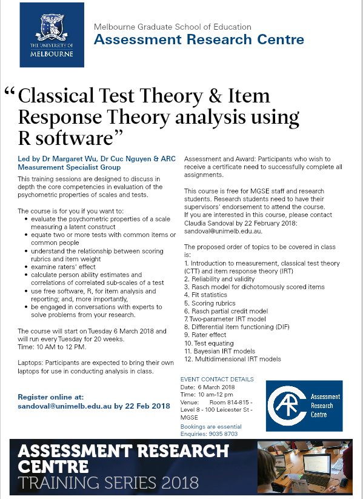

```{r setup, include=FALSE}
knitr::opts_chunk$set(echo = TRUE)
```

These are course notes and materials for 

## structure

Each week a new folder and webpage is added containing materials relevant to that week. 

The worked examples can be viewed at https://markdly.github.io/arc/

## downloading course materials

```{r downloading, eval=FALSE}

library(tidyverse)
library(rvest)
www <- "http://edmeasurementsurveys.com/MelbSD/"
docs <- read_html(www) %>% 
  html_nodes("td") %>% 
  html_nodes("p") %>% 
  html_nodes("a") %>% 
  html_attr("href")

download.file(paste0(www, docs), here::here("temp_downloads", docs), method = "libcurl", mode = "wb")
```

